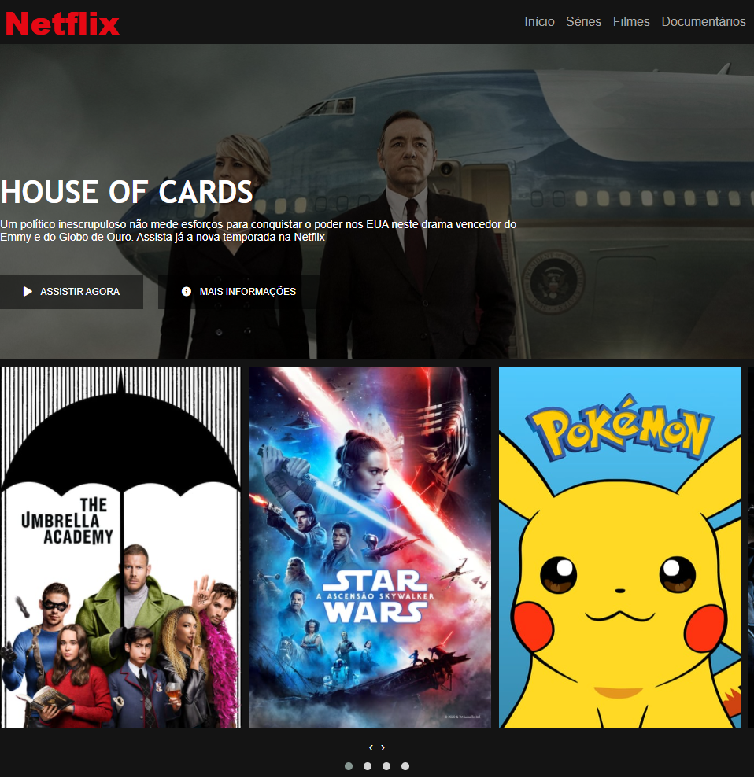

<h1>Réplica da interface da Netflix</h1>

<h2 align="center">Sobre o projeto</h2>

Esse projeto nada mais é do que uma réplica da interface da Netflix feito com o objetivo de treinar HTML, CSS e responsividade.

<h2>Imagem da réplica</h2>

<h2>Link para utilização</h2>
<a href="https://gallant-wright-dd1232.netlify.app" target="_blank">Clique aqui</a>

<h2 align="center">Construído com</h2>

- HTML5 semântico
- CSS3
- Media queries

<h3>Made with :heart: by Elivelton</h3>